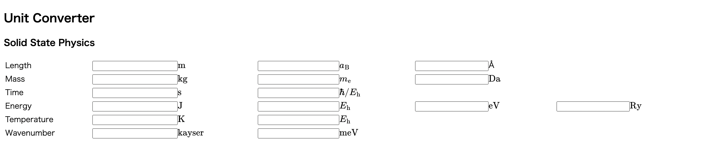

# Unit Converter for Solid State Physics

## Screenshot

## Usage
GitHub Pages is used for this tool.
So, please access the following URL and use it.

[https://cohsh.github.io/unit-converter](https://cohsh.github.io/unit-converter)

## Target
- Length
- Mass
- Time
- Energy
- Temperature
- Wavenumber